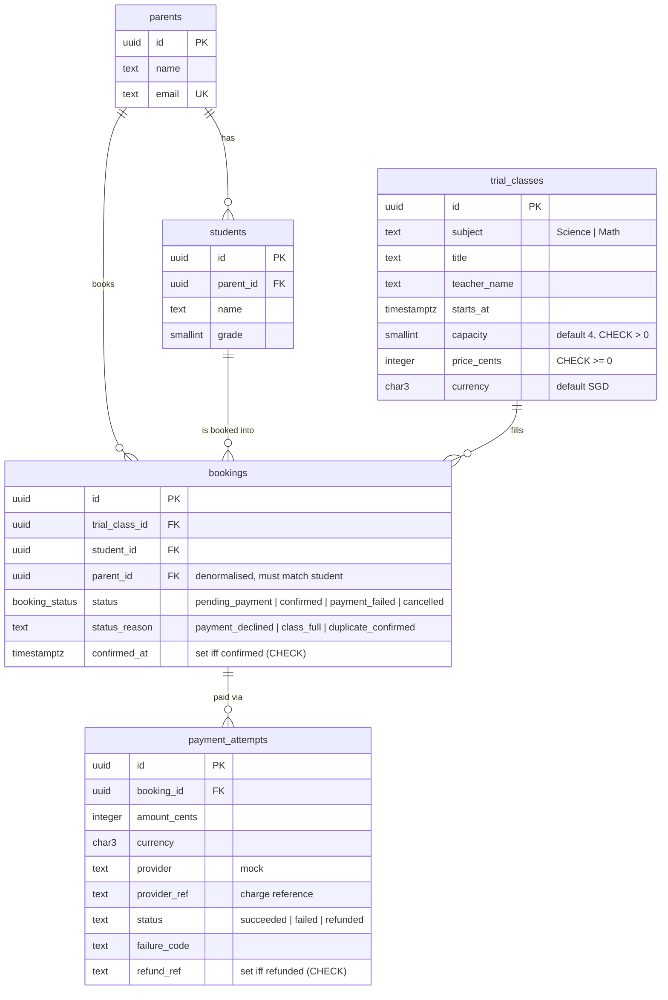
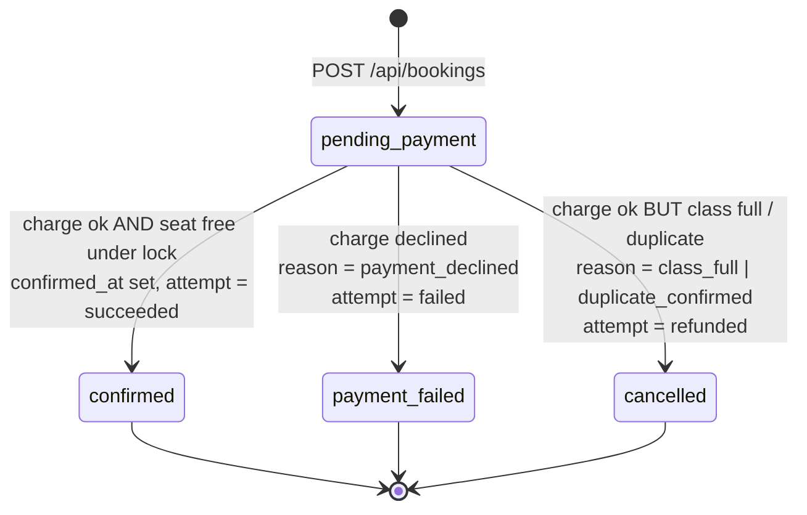

# Ottodot — Trial Booking (take-home)

## What this is

The smallest working slice of a trial-class booking system for Ottodot: a parent picks a child and a trial class, pays
(mock), and sees the booking's status; an admin sees the roster. The system enforces four invariants at the database
level — no duplicate confirmed bookings, never more than 4 confirmed per class, a failed payment never reaches the
roster, and the last-seat race ends with exactly one confirmed booking. It is one Go binary talking to PostgreSQL 16.

> 🎥 Walkthrough video: <LINK — Max to fill in>

## How to run

Prerequisites: **Go 1.25+** (any Go ≥ 1.21 will auto-download the right toolchain) and **Docker** (for Postgres).

```bash
git clone <repo-url> ottodot && cd ottodot
cp .env.example .env
docker compose up -d --wait        # PostgreSQL 16; creates databases `ottodot` and `ottodot_test`
go run ./cmd/migrate               # applies internal/db/migrations/*.sql
go run ./cmd/seed                  # fixed demo dataset (idempotent: truncates first)
go run ./cmd/server                # http://localhost:3000
```

A `Makefile` wraps the same commands (`make db-up db-migrate db-seed dev`), but every target is a plain `go run`.

**Demo path (2 minutes):** open <http://localhost:3000>, choose **Priya Nair**, pick **Diya**, pick
**Science: Why Do Volcanoes Erupt?**, *Continue to payment*, keep the pre-filled card `4242 4242 4242 4242`, *Pay*.
You land on the status page (**Confirmed**); *View class roster* shows Diya next to Aarav, 2 / 4 confirmed.
The same roster as JSON: <http://localhost:3000/api/trial-classes/c0000000-0000-4000-8000-000000000001/roster>.

| Test card | Outcome |
|---|---|
| `4242 4242 4242 4242` | succeeds |
| `4000 0000 0000 0002` | fails: `card_declined` |
| `4000 0000 0000 9995` | fails: `insufficient_funds` |
| anything else | fails: `invalid_card` |

### Running against Supabase

Paste the Supabase connection string (Project Settings → Database → URI, *session* mode) into `DATABASE_URL` in `.env`,
then run the same `migrate`, `seed`, `server` commands. No code changes: the schema uses only core Postgres
(`gen_random_uuid()`, enums, partial indexes, `FOR UPDATE`). `migrate -reset` drops only this app's tables, never the schema.

### No Docker?

`go run ./cmd/devdb` starts a real local PostgreSQL 16 on `:5432` (via `embedded-postgres`, binaries cached in
`~/.embedded-postgres-go`) with both databases, so the default `.env.example` works unchanged. Ctrl+C stops it.

### Run the tests

```bash
make verify          # gofmt + go vet + staticcheck (if installed) + go test ./... -count=1
go test ./... -count=1
```

Tests run against a **real Postgres**, never a mock: with `DATABASE_URL_TEST` set (the docker compose default) each
test package gets its own `<db>_<package>` database; with it unset, an embedded PostgreSQL 16 starts automatically.
Every test begins from the fixed seed. `go test ./internal/booking -run TestLastSeatRace -count=5 -v` re-runs the race
tests five times.

### Run the last-seat race demo

```bash
go run ./cmd/demo-race
```

Expected output (the second run starts with `Reset: removed 2 non-seeded booking(s) …`; booking IDs and ms vary):

```
Class C2 "Math: Fractions with Pizza" before: 3/4 confirmed, 1 seat left

User A (Priya → Aarav) created booking 65873ee6-ede0-4a65-a274-ff85c3e72eb0 → pending_payment
User B (Priya → Diya) created booking a568e58a-3b24-4c76-b130-2335caa3c562 → pending_payment

Both pay now. User A's provider call is delayed 300ms so User B lands first…

Who      Student         Finished   Outcome          Reason               Payment attempts       Message
----------------------------------------------------------------------------------------------------------------------------------
User A   Priya → Aarav   +359ms     cancelled        class_full           refunded               Payment was taken and has been refunded; the last seat was taken moments before you paid.
User B   Priya → Diya    +3ms       confirmed        -                    succeeded              Booking confirmed. Your child is on the class roster.

Class C2 after: 4/4 confirmed [Ethan, Mia, Noah, Diya], 0 seat left, is_full=true
OK: exactly one confirmed, one cancelled+refunded, roster at capacity.
```

## What I built

| # | Requirement | Where |
|---|---|---|
| 1 | Parent chooses a child and an available trial class | `GET /` (parent dropdown → children → classes with live `seats_left`; full classes visible but disabled) · `GET /api/parents`, `/api/parents/{id}/students`, `/api/trial-classes` |
| 2 | Parent submits a trial booking | `POST /bookings` (form) · `POST /api/bookings` → `pending_payment` |
| 3 | Mock payment step, result recorded | `GET`/`POST /bookings/{id}/pay` · `POST /api/bookings/{id}/pay` → one `payment_attempts` row per charge (`succeeded` / `failed` / `refunded`) |
| 4 | Booking status shown after submission | `GET /bookings/{id}` · `GET /api/bookings/{id}` (status, reason, plain-English message, payment history) |
| 5 | Admin/teacher roster (page + JSON) | `GET /admin/classes`, `/admin/classes/{id}` · `GET /api/trial-classes/{id}/roster` |

| Invariant | UI check (advisory) | Backend check | DB constraint (authoritative) | Tests |
|---|---|---|---|---|
| **I1** no duplicate confirmed booking per child+class | — | `CreateBooking` pre-check → `409 duplicate_confirmed`; re-checked under lock in `PayForBooking` | partial unique index `bookings_one_confirmed_per_student_class … WHERE status='confirmed'`; `23505` handled → refund + `cancelled/duplicate_confirmed` | #07, #08, #17 |
| **I2** never > 4 confirmed | full classes rendered disabled | `CreateBooking` pre-check → `409 class_full`; `PayForBooking` re-counts under `FOR UPDATE` | row lock on `trial_classes` serialises every confirmation for a class; `CHECK (capacity > 0)` | #03, #09, #11 |
| **I3** payment failure never reaches the roster | status page says so | declined charge → `payment_failed`, `failed` attempt, no status change to `confirmed` | roster and counts read only `status='confirmed'`; `CHECK (status='confirmed') = (confirmed_at IS NOT NULL)` | #05, #06, #13, #15b |
| **I4** last-seat race → at most one confirmed | pay page warns the seat is not reserved | charge first, then lock → count → confirm **or** refund + `cancelled/class_full` with an honest message | same row lock + partial index | #10, #11, #16, `demo-race` |

## Time spent

| Phase | Time |
|---|---|
| Reading the assignment, writing the build brief, choosing Go | <Max to fill in> |
| Schema, migrations, seed | <Max to fill in> |
| Service layer + mock provider | <Max to fill in> |
| Tests (incl. race tests) + demo-race | <Max to fill in> |
| API + HTML pages | <Max to fill in> |
| README, AI_USAGE, video guide, review | <Max to fill in> |
| **Total** | <Max to fill in> |

## Assumptions

- One currency (SGD), one price per class, stored in cents. No taxes, discounts or partial payments.
- No authentication: the parent is chosen from a dropdown and sent as `parent_id`; the service still checks the child
  belongs to that parent. Production would derive `parent_id` from the session, never the body.
- One child per booking; a parent books each child separately.
- A class can be booked only while `starts_at` is in the future (checked against the database clock).
- Refunds are immediate and always succeed (mock). Production would use pre-authorisation + capture/void instead.
- **Pending bookings do not hold a seat.** Seats are counted only from `confirmed` rows. This is the tradeoff that
  makes the last-seat race possible — and it is settled honestly at payment time (see below).
- `payment_failed` and `cancelled` are terminal for that booking row; the parent retries by creating a new booking.

## Backend & architecture decisions

### Data model / schema

Five tables, one enum, no stored counters. Seats are always **derived**: `count(*) WHERE status = 'confirmed'`.
A `seats_taken` column would be a second source of truth that can drift from the bookings table and needs
reconciliation; at 4 seats per class the count is free.



Indexes (`internal/db/migrations/0002_booking_constraints.sql`):

```sql
CREATE UNIQUE INDEX bookings_one_confirmed_per_student_class
    ON bookings (student_id, trial_class_id) WHERE status = 'confirmed';   -- I1
CREATE INDEX bookings_class_status_idx ON bookings (trial_class_id, status); -- roster + counts
```

### Key endpoints & service functions

Business logic lives in `internal/booking` and knows nothing about HTTP; both the JSON API (`internal/httpapi`) and
the HTML pages (`internal/web`) call the same four functions.

| Service function | Endpoint(s) | Notes |
|---|---|---|
| `CreateBooking(parent, student, class)` | `POST /api/bookings` | pre-checks (ownership, class in future, duplicate, capacity) → insert `pending_payment`; returns amount due |
| `PayForBooking(booking, parent, card)` | `POST /api/bookings/{id}/pay` | the critical path; returns `outcome ∈ {confirmed, payment_failed, cancelled}` + booking |
| `GetBookingDetail(id)` | `GET /api/bookings/{id}` | status, reason, message, payment attempts |
| `GetRoster(class)` / `ListClasses()` | `GET /api/trial-classes/{id}/roster`, `GET /api/trial-classes` | `count(*) FILTER (WHERE status='confirmed')` in SQL; `is_full` flag |

Errors are always `{"error":{"code","message"}}` with the right status (`400 validation_error`, `403 forbidden`,
`404 not_found`, `409 class_full | duplicate_confirmed | class_started | booking_not_pending`). Every response echoes
`X-Request-Id`; every request writes one JSON log line.

### Booking statuses



Only `pending_payment` can be paid; anything else → `409 booking_not_pending`. A confirmed booking has exactly one
`succeeded` attempt; a `cancelled` one has a `refunded` attempt whose `provider_ref` is the original charge and
`refund_ref` the refund.

### Preventing duplicate bookings

Three layers, innermost authoritative:
1. `CreateBooking` returns `409 duplicate_confirmed` if a confirmed row already exists (friendly, early).
2. `PayForBooking` re-checks inside the locked transaction (a duplicate could have confirmed since step 1).
3. The **partial unique index** on `(student_id, trial_class_id) WHERE status='confirmed'` makes a second confirmed
   row impossible regardless of code path. `PayForBooking` catches SQLSTATE `23505` on that index and treats it exactly
   like the in-transaction duplicate: refund + `cancelled/duplicate_confirmed`. Test #17 forces this path by bypassing
   layer 2. The index is *partial* on purpose: `payment_failed` / `cancelled` rows may repeat, so retries work.

### Handling payment failure

The charge happens **before** any transaction. On decline, one short transaction inserts a `failed` attempt with the
provider's `failure_code` and moves the booking to `payment_failed` / `payment_declined`. Nothing touches the roster:
the roster and every seat count only read `status='confirmed'`, and a `CHECK` ties `confirmed_at` to that status.
The parent sees "You have not been charged and no seat was taken" and can start a new booking for the same child and
class (test #06). The seeded class C4 demonstrates it: Ethan's `payment_failed` booking, roster 0 / 4.

### Two users competing for the last seat

**Scenario:** A and B both reach the payment page for the last seat of C2 (3 / 4 confirmed). B pays first and
confirms. A then pays.

**Approach — chosen:** pessimistic row lock + derived count + partial index, in this exact order
(`internal/booking/service.go`, `PayForBooking` → `confirmUnderLock`):

1. Load booking; must belong to the parent and be `pending_payment`.
2. `Charge(card)` — **outside** the transaction.
3. `BEGIN` (READ COMMITTED is enough because of the lock)
   `SELECT capacity FROM trial_classes WHERE id = $class FOR UPDATE` — every confirmation for this class now queues here.
   `SELECT status FROM bookings WHERE id = $booking FOR UPDATE` — guards a double-pay of the *same* booking.
   `count(*) … WHERE status='confirmed'` and `EXISTS(… same student … confirmed)`.
4. Seat free and no duplicate → `UPDATE bookings SET status='confirmed', confirmed_at=now()` + insert `succeeded` attempt, `COMMIT`.
   Otherwise → `Refund(charge)`, insert `refunded` attempt, `UPDATE … status='cancelled', status_reason='class_full'`, `COMMIT`.
5. `23505` from the partial index (unreachable while the lock is honoured) → same refund + cancel path.

**Result for A:** `cancelled / class_full`, a `refunded` payment attempt, and the message
*"Payment was taken and has been refunded; the last seat was taken moments before you paid."* Not a silent failure,
not a phantom fifth seat, not a charge with nothing to show for it.

**Why lock the class row, not booking rows:** the invariant is a property of the *set* of bookings for a class. Two
different booking rows can each be locked and each be flipped to `confirmed`; one class row is the single gate
everything must pass through.

**Why charge before locking:** holding a row lock across a payment-provider round trip would serialise every payment
for a class behind the slowest card network, and a provider timeout would hold the lock. Charging first keeps the
critical section to five statements — single-digit milliseconds — at the cost of the rare paid-then-refunded path.
In production this would be a pre-authorisation, with capture inside the lock and void on the losing path.

**Rejected alternatives**

| Alternative | Why not (for this slice) |
|---|---|
| **A. Seat holds with TTL** — a pending booking reserves the seat for N minutes; a job releases expired holds | Better UX (A would be told "sold out" *before* paying). Needs a background job, expiry handling and an extra state (`held`/`expired`). Listed under *What I would do next*; the `cancelled/class_full` rate after release tells us whether it is worth building. |
| **B. Optimistic concurrency** — `seats_taken` counter + version column, retry on conflict | Fewer locks, but a denormalised counter that can drift from `bookings` and needs reconciliation. The derived count is simpler to reason about at 4 seats. |
| **C. `SERIALIZABLE` + retry on `40001`** | Correct, but retry loops are harder to test deterministically and easier to get subtly wrong. One explicit `FOR UPDATE` on one row is easier to read in review. |

**Accepted costs:** (1) the loser is charged and immediately refunded (mock); (2) pending bookings do not hold seats,
so two parents can both be on the payment page — that is precisely the scenario, handled at confirmation time.

### Where each check lives

| Check | UI | Backend (service) | Database | Background job |
|---|---|---|---|---|
| Child belongs to parent | dropdown only shows own children | `403 forbidden` | FK to `parents` | — |
| Class is in the future | only upcoming classes listed | `409 class_started` (DB clock) | — | — |
| Class has a seat | full classes disabled, still visible | advisory `409 class_full` at create; **authoritative re-count under `FOR UPDATE` at pay** | row lock on `trial_classes`; `CHECK (capacity > 0)` | — |
| No duplicate confirmed | — | advisory at create; re-check under lock at pay | **partial unique index** (+ `23505` handler) | — |
| Card is well-formed | form fields pre-filled | `400 validation_error` (`payments.Validate`, shared by API and form) | — | — |
| Payment outcome recorded | status page | one `payment_attempts` row per charge | `CHECK` on status ∈ {succeeded, failed, refunded}; `refund_ref` iff refunded | — |
| Only pending bookings can be paid | pay page redirects if not pending | `409 booking_not_pending`; re-read under lock | `CHECK confirmed_at iff confirmed` | — |
| Hold expiry / refund reconciliation | — | — | — | *would be here* (none in this slice) |

UI checks are advisory; the database is authoritative. There is no background job in this slice; the two that a
production version would need are hold expiry (if seat holds are added) and a reconciliation job comparing provider
charges with `payment_attempts` (see *What I would monitor*).

## Verification

Two minutes:

1. `make verify` — gofmt, `go vet`, `staticcheck`, then the suite against a real Postgres:
   ```
   ok  	ottodot/internal/booking	16.204s
   ok  	ottodot/internal/httpapi	14.518s
   ok  	ottodot/internal/payments	0.510s
   ```
   The test names read as the spec (`go test ./... -v`):
   ```
   01 creates a pending_payment booking for an eligible student and class
   02 rejects booking a student who does not belong to the parent
   03 rejects a class that is already full at creation time
   04 payment success on a class with seats → confirmed, exactly one succeeded payment attempt
   05 payment failure → payment_failed, failed attempt recorded, roster unchanged (I3)
   06 after payment_failed, the parent can create a new booking for the same child/class and confirm it
   07 duplicate confirmed booking for same child+class is rejected at creation (I1, service layer)
   08 duplicate confirmed booking is rejected at the DB level even if the service check is bypassed (I1, DB layer)
   09 never exceeds capacity: with 3 confirmed, the 4th confirms and the 5th is cancelled with class_full and refunded (I2)
   10 last-seat race: two concurrent payments for one remaining seat → exactly one confirmed, the other cancelled+refunded (I4)
   11 last-seat race, 10 concurrent payers for 1 seat → exactly one confirmed
   12 paying a booking that is not pending_payment → 409
   13 roster lists only confirmed students and reports seats_left = capacity - confirmed
   13b list classes derives confirmed_count/seats_left/is_full in SQL and keeps full classes visible
   14 POST /api/bookings validates the body and returns 400 on bad input
   15 POST /api/bookings/:id/pay end-to-end happy path returns confirmed
   15b POST /api/bookings/:id/pay with a declined card returns outcome=payment_failed and leaves the roster unchanged
   16 concurrent double-pay of the same booking → one confirmed, the duplicate charge refunded
   17 unique_violation fallback: with the in-transaction duplicate check bypassed, 23505 is caught and the booking is cancelled+refunded
   ```
   Test #10 logs the interleaving (`B finished at +3ms (confirmed), A finished at +309ms (cancelled/class_full)`) and
   fails if B did not finish first, so it cannot pass vacuously.
2. `go run ./cmd/demo-race` — output above; exit code 1 if the invariant is ever violated.
3. Manual click-through of the four seeded cases (`go run ./cmd/seed` first):

| Case | Do | Expect |
|---|---|---|
| **C1** seats available | Priya → Diya → *Science: Why Do Volcanoes Erupt?* → pay `4242…` | **Confirmed**; roster 2 / 4 (Aarav, Diya) |
| **C4** payment failure | Marcus Tan → Ethan → *Math: Shapes All Around Us* → pay `4000 0000 0000 0002` | **Payment failed** / `payment_declined`, `failed` attempt with `card_declined`; roster stays 0 / 4 |
| **C3** duplicate | Priya → Diya → *Science: The Water Cycle* → Continue | red banner "this child already has a confirmed booking for this class" (Diya is seeded there) |
| **C2** full class | run `demo-race` (C2 becomes 4 / 4), then Sofia Lim → any child | *Math: Fractions with Pizza* shows **Full** and cannot be selected; `POST /api/bookings` for it → `409 class_full` |

## What I deliberately cut

| Cut | Why it is safe for this slice |
|---|---|
| Authentication / sessions | The assignment says no auth is needed; `parent_id` is still verified against the student's parent, so the invariants do not depend on it. |
| Regular enrollment | Explicitly out of scope. Nothing in the schema is trial-specific except the table name, so it would be an additive change. |
| Seat holds with TTL + expiry job | Requires a background worker and a new state. The race is handled correctly without it; the metric to justify it is listed below. |
| Real payment provider, webhooks, pre-auth/capture | Mock provider with deterministic cards exercises every path (success, two decline codes, refund) with zero flakiness. |
| Idempotency keys on `/pay` | The double-pay guard (booking row re-read under lock, duplicate charge refunded) covers the *correctness* case; keys would avoid the second charge altogether. |
| Frontend framework, JS, styling | Plain forms + one stylesheet render every flow; the assessment values backend judgement. |
| Email, i18n, admin auth, roster export, pagination | None affect the invariants. |
| ORM / query builder / migration framework | pgx + hand-written SQL keeps the `FOR UPDATE` and the partial index visible in review; two migration files do not justify a framework. |

## What I would monitor after release

| Signal | Why | Alert |
|---|---|---|
| `count(confirmed) > capacity` per class (SQL check every minute) | I2 must be impossible; this is the canary | any row → page |
| Rate of `cancelled / class_full` per day | measures how often the race actually happens → decides whether seat holds are worth building | trend, weekly review |
| `cancelled / duplicate_confirmed` and `23505` handler hits | should be ~0; non-zero means a code path skipped the lock | any → investigate |
| `payment_failed` rate by `failure_code` | provider / card issues vs product issues | > 20% sustained |
| Refund count and refund latency | every `cancelled` must have a `refunded` attempt; latency matters once refunds are real | missing refund → page |
| p95 / p99 of `POST /api/bookings/{id}/pay` (from the request log) | provider latency + lock wait | p95 > 2s |
| Lock wait time on `trial_classes` (`pg_stat_activity` / `pg_locks`) | the critical section should be milliseconds | > 100ms |
| Reconciliation job: provider charges ↔ `payment_attempts` | catches a crash between charge and commit (charge exists at provider, no row here) | any orphan → refund + alert |

## What I would do next

1. **Seat holds with TTL** (`held` state, `expires_at`, background expiry) so the loser is told before paying — build only
   if the `cancelled/class_full` rate says so.
2. **Pre-authorisation + capture/void** instead of charge + refund; capture inside the lock, void on the losing path.
3. **Idempotency keys** on `/pay` (client-generated, unique index on `(booking_id, idempotency_key)`) to make retries
   free instead of "charged then refunded".
4. **Webhook-driven confirmation** for asynchronous providers, with the same lock-and-count step on the webhook.
5. **Auth** (parent sessions, admin role) — `parent_id` from the session, not the body.
6. **Observability**: metrics for the table above, tracing around `/pay`, the reconciliation job.
7. Admin roster export (CSV) and a waitlist.
